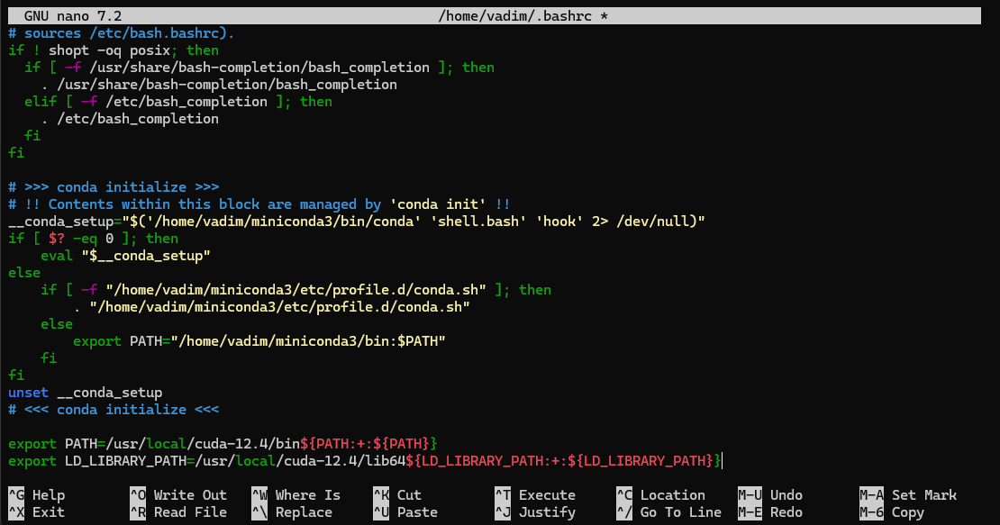
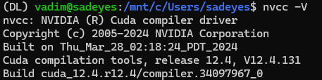
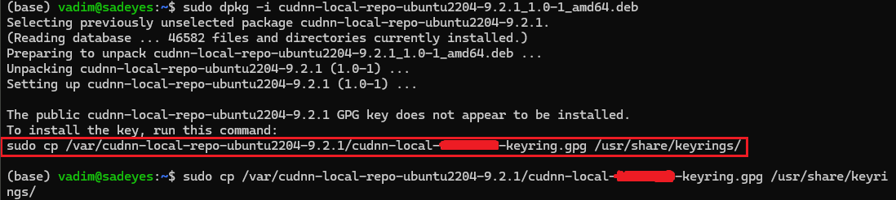
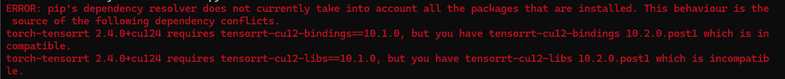
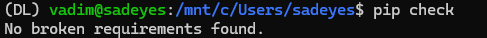
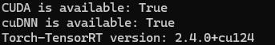

# PyTorch (CUDA) installation guide for WSL2 with cuDNN and TensorRT
WSL and CUDA installation instructions


## Install WSL2
To install specific version of WSL2 run:
```
wsl --list --online
```
Choose the version you want to install and run (example for Ubuntu 24.04):
```
wsl --install Ubuntu-24.04
```
## Update WSL2
Enter WSL2 shell:
```
wsl -d Ubuntu-24.04
```
Change working directory:
```
cd ~
```
Update the system:
```
sudo apt update 
sudo apt upgrade -y
```
## Install conda
Download [Miniconda](https://www.anaconda.com/docs/getting-started/miniconda/main) for Linux (check your architecture: ```x86_64```, ```aarch64``` or ```s390x64```):
```
wget https://repo.anaconda.com/miniconda/Miniconda3-latest-Linux-x86_64.sh
```
Install Miniconda:
```
bash Miniconda3-latest-Linux-x86_64.sh
```
> Do you wish to update your shell profile to automatically initialize conda?<br>
`yes`

**Re-open shell**

## Install build-essential
```
sudo apt install build-essential
```

## Install CUDA toolkit

Download [CUDA toolkit](https://developer.nvidia.com/cuda-toolkit-archive), for example, I will install `CUDA Toolkit 12.4.1` for `x86_64`.

Linux -> $YOUR_ARCHITECTURE -> WSL-Ubuntu -> 2.0 -> runfile (local)

```
wget https://developer.download.nvidia.com/compute/cuda/12.4.1/local_installers/cuda_12.4.1_550.54.15_linux.run

sudo sh cuda_12.4.1_550.54.15_linux.run
```

**accept -> Install**

**Add to PATH**

```
nano ~/.bashrc
```

Add the following lines to the end of the file:

```
export PATH=/usr/local/cuda-12.4/bin${PATH:+:${PATH}}
export LD_LIBRARY_PATH=/usr/local/cuda-12.4/lib64${LD_LIBRARY_PATH:+:${LD_LIBRARY_PATH}}
```



**CTRL+O (save) -> Enter -> CTRL+X (exit)**

```
source ~/.bashrc
```

Check if CUDA toolkit is installed correctly:

```
nvcc -V
```




## Install cuDNN

Download [cuDNN](https://developer.nvidia.com/cudnn-archive). I will install `cuDNN 9.2.1` to match `CUDA Toolkit 12.4.1` and PyTorch requirements.

Linux -> $YOUR_ARCHITECTURE -> Ubuntu -> 22.04 -> deb (local)

```
wget https://developer.download.nvidia.com/compute/cudnn/9.2.1/local_installers/cudnn-local-repo-ubuntu2204-9.2.1_1.0-1_amd64.deb

sudo dpkg -i cudnn-local-repo-ubuntu2204-9.2.1_1.0-1_amd64.deb
```

**Next step you should copy from shell output:**


Install cuDNN

```
sudo apt-get update
sudo apt-get -y install cudnn-cuda-12
```

## Install PyTorch and TensorRT

```
conda create -n DL python=3.11.9

conda activate DL

python -m pip install torch torch-tensorrt tensorrt --extra-index-url https://download.pytorch.org/whl/cu124

pip install "nvidia-modelopt[all]" --extra-index-url https://pypi.nvidia.com
```

**TensorRT installation may take a long time (5-15 min), just wait**

Check dependencies:

```
pip check
```

If you have next error:


Fix dependencies:

```
pip install tensorrt-cu12-bindings==10.1.0 tensorrt-cu12-libs==10.1.0
pip check
```



## Check if everything is installed correctly

```python
python -c "import torch; import torch_tensorrt as trt; print('CUDA is available:', torch.cuda.is_available()); print('cuDNN is available:', torch.backends.cudnn.is_available()); print('Torch-TensorRT version:', trt.__version__)"
```




Delete pip cache:

```
pip cache purge
```
